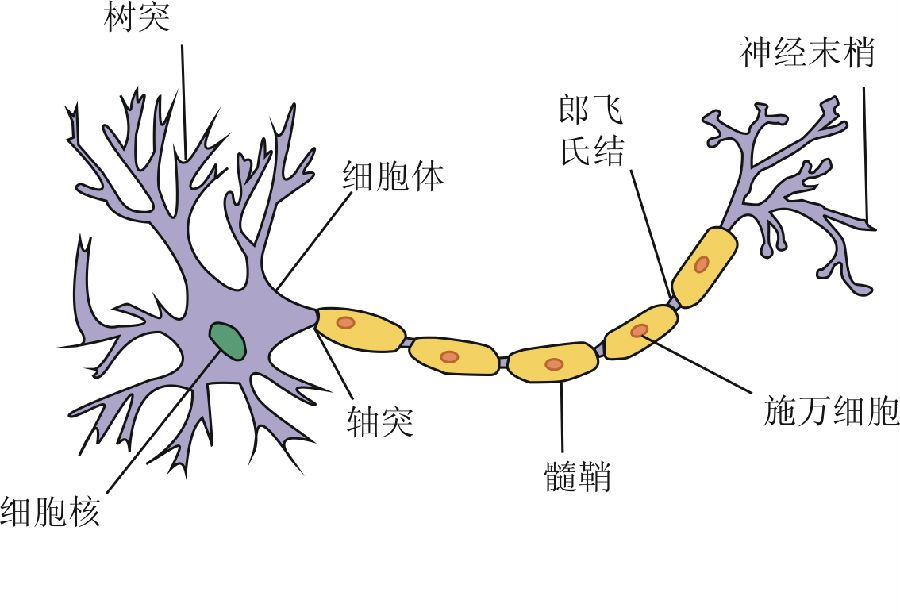
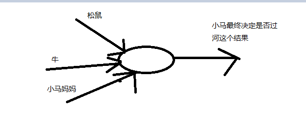
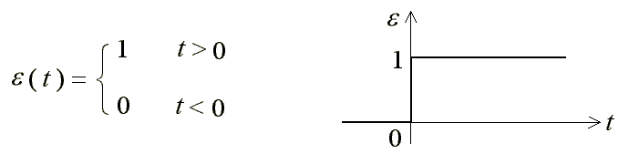
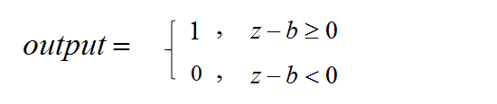
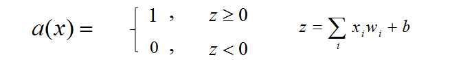

# 自我介绍以及神经网络的一些知识的背景介绍

### 自我介绍

当然了，没有人会这github上征婚，所以我不会介绍自己的特征的一些信息，而是介绍我为什么要写这么一篇教程。首先我自己在学习有关神经网络的知识，并且想用它来实现手写数字识别的效果，以前我使用opencv来做各种的操作，在图像处理上opencv确实是非常方便，网上也有不少的介绍和经验的文章，所以我在学习opencv图像处理的时候基本上遇到的问题比较少。但是到了后来的识别的部分就遇到了问题，我总是训练不出来自己想要的结果，在网上搜索了不少的问题总是没有找到有效的信息，所以我决定先放下这个问题，先学习神经网络吧，自己实现一个不就不用这么难堪地寻找着网上的资源了吗？说实话，年轻人确实很容易冲动，一时不会考虑这个想法的一些后果，说干就干。

冲动是需要付出一定的代价的，这不，关于神经网络的教程倒是不少，不过大家都陷入了“知识之祸”的坑，几乎所有的教程都会假设它们的思路是清晰的、知识点是简单的、学习者是牛逼的···所以这些教程就非常的马虎，总是以为学习者什么都应该知道，所以看了不少的文章以及视频，还是不会编写一个神经网络以及实现它们的算法，倒是看了这么多的教程对于神经网络的概念了解得很深入，比如说相应的的专业名词有多少种翻译以及它们的英文名字是什么，但是知道这儿多有什么卵用，你不会编写那就等于是白扯。幸好后来遇到前面给各位推荐的文章，我认真地阅读了，并尝试跟着文章进行推导，后来再看一下它给的代码，瞬间思路清晰，有种茅塞顿开的感觉。所以我希望我的教程中也有这样的效果，希望能帮助到你。

我会在这个教程中讲解BP（back propagation 反向传播）算法的推导以及Python实现，其他的算法我还没有涉及，对于神经网络的前世今生我也不是很了解，所以我都不会在教程上把这些都写出来，所以我希望这不是一个科普的文章。

### 神经网络以及BP神经网络的一些背景知识的介绍

神经网络原本指的是人类或是动物的神经系统的一个描述，它是由很多歌神经元相互交叉组合形成的一些网络，我个人对生物学不是很了解，不知道现在的学术界对人类神经系统的研究达到什么程度了，不过我能肯定的是生物体上的神经网络的连接形式肯定非常复杂，但是对于我们来说，想用它来做一些事情我们只需要简化这个连接方式来建立相应的模型就可以了。

人工神经网络（Artificial Neural Network，简称ANN ），它从信息处理角度对人脑神经元网络进行抽象（注意，这里只是对人脑的神经元进行抽象，并没有对人的大脑进行抽象，因为我们还没有达到这个认知水平）， 建立某种简单模型，按不同的连接方式组成不同的网络——其中我们本次课要讲的BP神经网络就是其中的一种（大部分来自[百度百科](http://baike.baidu.com/link?url=R7zO1xqSZj125w92VY89ssYUPgC88lOAeiBBOC0R6PWDO3dztbz91k1A7IqxxUI2EnwjBCnoTDhXjU2rpjXXq9FqZF8hOTK6Ut0elfLi128FyLvWNfR6ummi0CksPLjQ)）

BP人工神经网络：BP（Back Propagation反向传播），是一种按误差逆传播算法训练的多层前馈网络，这里前馈就是向前反馈，也就是反向传播的意思，关于误差呢我们后面在公式推导下一节会讲到，大家不理解也没关系（有小部分来自[百度百科](http://baike.baidu.com/link?url=2JdcxZ-9QWl8AmRO_LSnItzhC3fyl7Uck5VNLcB_R3RTr4JlacgxI0pp2BewjDgH61nvQ-lhOUs7DZ2rOK4aSYvmJYMaXofYM7qy9bE_Qk4qATrXkAZhIn1Oi4hPezrB)）。

最重要的一条，现在的新闻上（特别是百度新闻、腾讯新闻、今日头条、新浪）总是将人工智能与神经网络挂钩，动不动就是卷积神经网络、循环神经网络···还有自己说自己的产品经过多少时间、多少强度的训练之内的，但是我个人不敢苟同，我不敢苟同这些新闻编辑者的话，人工智能是一个大的范围，并不是一个神经网络就能概括得了的，就像神经网络本身也包括不少的分类，其中各自在不同的地方的优势表现也不一样，所以说我认为神经网络只是一部分，但是它绝对足够复杂，我们现在学习的东西都是不少的学者、研究员花了很多的时间进行研究才得出的一些经验性的结论，我们敬重他们，同时我们也敬重未来，因为我们不会满足于现状，不断研究，将来人们同样怀着相类似的心情来学习这些知识。

#### 生物体的神经元

来看一下一张神经元的图片：

如图所示为一基本的神经细胞，也称为神经元，我们可以忽略细胞核还有细胞体之类的名词，因为我们只关注树突和轴突这两个部分。树突在一个神经元中有很多个，就像图像里的那样，它可用来连接很多的其他的神经元，然而轴突却只有一个。根据生物学家们的研究，发现神经元中的树突是用来接收由其他的神经元传递过来的信息的，而轴突则用来向其他的神经元传递信息的。所以我们可以简单地理解神经元有这样一个特点——`多输入、单输出`。我们其实也可以想象，为什么说生物体的神经系统很复杂呢？就拿它的结构来说，一个神经元就可以和多个神经元相接触，而自己却只能和一个神经元相接触，我们根本不知道某一个信息沿着哪一条路走，没有办法追踪这些信息。不过我们至少能知道神经元的一个特性——`多输入，单输出`，这个对于我们建立模型非常有帮助。


那么现在又有一个问题了，这么多的信息传递过来，神经元怎么来提取相关的有效信息呢？（我说的相关的有效信息是一个抽象的说法，其实细胞量级的信息传输是什么样的我也不清楚）我记得高中的时候老师讲过神经元与神经元之间是通过一些特殊的物质来传递信息的，我们称之为介质，下一个神经元是否接受上一个神经元的信息取决于它们之间的介质多少。如果下一个神经元不接收上一个神经元的信息，那么我们将这样的情况称之为抑制，反之称之为兴奋。

### 感知器

我最不喜欢的东西就是遇到一个东西就需要将这个东西解释一遍了，这样太累人了，还不如我们从故事中感受，下面我自己来回忆一下童年，童年中其实我并不是快乐的，因为你知道在学校里总是要花很多的时间待在教室里，倒不是说我爱学习，而是好像那会儿老师害怕我们出事，索性将我们留在教室，不过这样也不是没有好处的，毕竟我还记得下面一个小的故事。

小的时候我们学过这么一篇文章——《小马过河》，小马要过河，来到了河边儿，正准备过河呢？就有两个熟悉的声音叫住了他，一个是松鼠的，说不让他过河，河水太深了，会被淹死的；另一个是牛的声音，河水很浅，可以过去的。但是毕竟小马不是什么见过大世面的马，它犹豫不决，所以又回来找了它的妈妈，问妈妈到底过不过河，然后妈妈告诉他自己尝试去，最终小马还是过了河。这是一个很好的儿童故事，我个人认为这也是一个用来作为神经元接受信息举例的好故事，我们可以做如下的分析，假设小马现在就是我们所要研究的一个神经元，它要过河的时候接收到了来自三个不同的人的建议，分别是松鼠、牛和小马的妈妈，我们假设小马会过河的状态为1，不会过河的状态为0，其他不同的人的建议之中建议过河的为1，不建议过河的为0，那么我们就可以得到下面的一个模型：


你会发现上面的故事中小马比较听妈妈的话，对于松鼠和牛的话持有怀疑的态度，那么我们怎样在我们的模型中有所体现呢？不如我们假设松鼠的建议为`X1`，牛的建议为`X2`，小马妈妈的建议为`X3`，既然小马比较听妈妈的话，我们就设置`X3`大一些，松鼠和牛的建议设置地得小一些。那么现在还有一个问题，那就是小马怎么来判断哪一个建议应该听取呢？我们可以模拟一个阶跃函数（如果你见过方波的函数图像，你应该不会陌生），阶跃函数的图像类似于下面的图像：

不过如果我们的小马的头脑太简单的话，我们是不能接受的，所以我们为小马设定一个阈值，我们使用`b`来表示（bia），如果所有的输入大于这个阈值，小马就会过河，否则就不会过河。再次说明一下，松鼠、牛以及小马妈妈的建议值只能为1或者0，但是在上面的语言中我为了说明小马怎么判断谁的信息更为重要使用到了一些有悖于我们规定的说法，所以希望大家理解万岁吧。如果只是1或者0的话就没有办法表示谁会更重要一些了，我们可以为每一位输入的人设置一个权值，用`ω`（这是希腊字符，为了方便，以后我都会使用`w`来代替了）表示，所以对于小马来说，三位过来人给出的总输入可以这样表示，我们用`z`来表示，则有：

```bash
z=w1 * X1 + w2 * X2 + w3 * X3
```

我们想让小马妈妈的话语更加有影响力的话，我们将`w3`设置得高一些就可以了，所以最终小马的决策就像下面的式子：

现在我们有权利来左右小马的决策了，我们可以任意设置每一个输入的权值（w）以及小马的决策阈值（b），让小马做出不同的行为。

这就是我们所要解释的感知器的模型，感知器是研究者们用来模拟生物体的神经元的工作方式的一种模型，感知器有多个输入，一个输出，每一个输入值都有自己相对应的权值`w`，输出的时候有一个阈值`b`，我们在上面使用的阶跃函数来处理所有的输入的信息，这个阶跃函数称之为激活函数，我们使用`a(x)`来表示，下面我们稍稍改变一下我们这个阶跃函数的形式，不让其在最后减去`b`，而是加上`b`，这其实知识数学上的改变，其中并没有真正改变我们的思路，如下图所示：