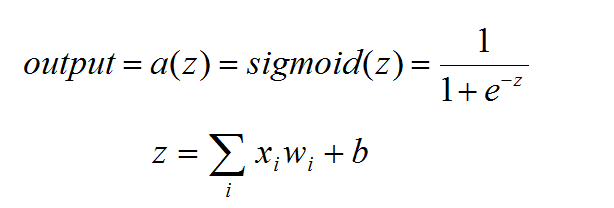
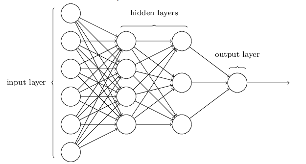

### sigmoid神经元

其实你会发现我们上一次讲到的感知器的模型有点儿僵硬，我们对于输入只能是1或者0，输出只能是1或者0，为什么我们不能使用小数来表示呢？对于小马过河的例子，使用1或者0确实很贴切，因为我们确实只有两个状态——过还是不过。但总归我们主宰这个世界的生物，我们可以改变很多事情，拿一个我自己的历史来说吧，以前高一的时候我们没有分文理科，还在考历史，每一次考试我的历史成绩都会比较低，为什么呢？因为我每一次考试都会篡改历史······

但是现在我们要做一个小小的改变来适应我们的情况，我们不想用僵硬的状态来表示小马会不会过河了，我们相拥概率这个东西来表示小马会不会过河，假如说概率大于0.5那么表示小马会过河，否则就不会过河，既然这样，我们也可以相应的将三位过来人的建议设置为0到1的一些数，如果这个数大于0.5呢表示这位过来人支持过河，越大表示支持的力度越大，反之则不然。另外我们觉得感知器的激活函数该换一换了，毕竟阶跃函数在这里显得非常死板，现在我们需要一个这样的函数——它的值为0到1之间，如果你能记得反三角函数就能很快想起来，反三角函数正好符合这个要求，不过我们今天不会使用它们，就像你需要找一个对象，你的要求当然是跟你有着不同的性别，这是基本的要求，所以说这个基本的要求地球上有一半儿的人都满足，所以你还得进行筛选，知道你遇到心仪的为止。所以我们将会使用一个叫sigmoid的函数，为什么不用反三角函数呢？其实这个我也没有弄清楚，使用sigmoid函数是因为很多的论文都在使用它（也就是学术界都承认这个函数比较好），如果你觉得你有其他的选择，你可自己试试，也许会有大的收获呢！sigmoid函数定义以及函数图像如下：

我现在感受到了“主宰”这个词语的美妙，似乎这个世界在我们的带领下走向了光明，我们的输出不再是僵硬的1或者0了，而是0到1之间的任何值。

这就是sigmoid神经元，我觉得倒不如说是sigmoid感知器，不过我自己都发现这个名字跟“二狗子”一样比较别扭，所以叫sigmoid神经元比较高大上一些，sigmoid神经元与感知器类似，有多个输入，每一个输入值都有一个权值，当然sigmoid神经元也有自己的阈值，它的激活函数当然是sigmoid函数了，所以就用下面的表示方法：

### 神经网络的连接方式

讲了不少的神经元的东西，它是神经网络的基础（废话），生物体上的神经元错综复杂，我们可能找到了神经网络开始的部分，但是我们却找不到神经网络的结尾的部分，更不知道在生物体上的神经网络是怎么分布的，或是连接情况是什么样的。为了解决这个世界性的难题，有人就假设出了神经网络的连接方式——分层次的全连接，当然这是为了我们人工神经网络的建模而简化的东西，实际上生物体上的神经网络并不是这样的。那么分层次的全连接是什么意思呢？请看下一幅图：

如你所看到的，在神经网络上我们分为输入层、隐藏层、输出层，其中输入层的神经元并不是一个sigmoid神经元，因为它自己本身没有别的输入，所以就没有必要使用权值以及阈值之类的东西，其他的层上的神经元都是sigmoid神经元。除了输入层之外，每一层的神经元都与上一个神经层的所有神经元相连接，这与我们的感知器模型有点儿不同，所以我在介绍sigmoid神经元的时候没有说它是单输出的，相反，它是单输出、但却是输出多连接的神经元，这一点大家要注意一下，到了最后一层就没有继续连接下去了（又是废话），事情总不能循环无止境吧？另外我们只是建立相应的模型来研究我们的问题，而不是来研究生物体的神经系统，所以我们就不必搞一个大新闻了，让它有始有终吧。

###  小结

这就是全部的神经网络的简介，我们分别介绍了感知器、sigmoid神经元以及有sigmoid神经元连接起来的神经网络。篇幅不是很长，对于阅读者来说应该不会有太大的压力，不过我希望你不要只是匆匆浏览过去，一定要记得我们给出的几个公式自己它们各自代表的含义。如果你已经达到标准了，那么我们进入下一章节的学习吧！

[Prev](./1.md)                             [Next](../chapter2/1.md)