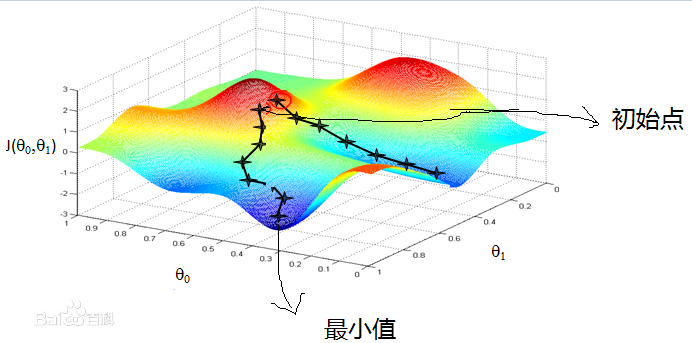

## 如何求解成本函数的极小值

如果我们仅仅指的是如何通过数学上的推算来求解成本函数的极小值那就太简单了，我们前面也说过，我们是通过迭代的方式来求解成本函数的极小值的，说到迭代说明咱们会使用计算机来帮我们完成这些任务，而不是我们帮计算机完成这些任务。我们将会使用到梯度下降法来求解进行迭代求解。

#### 梯度

先给一个百度百科关于梯度的链接——[梯度百度百科](http://baike.baidu.com/link?url=tSf2drIpyEIdXV7T29-_D-oe1XRBaUYor-cxNSN1v5fynsJov_LBF_jhZF_2EV0XQK1o1ArOpxTFiZnkB2t_pFXA0ACB-fu9aWQKbffrDAG)，再来一个维基百科的——[梯度维基百科](https://zh.wikipedia.org/wiki/%E6%A2%AF%E5%BA%A6)，在百度百科上说，标量场中某一点上的梯度指向标量场增长最快的方向，梯度的长度是这个最大的变化率。不过这句话有一些绕，什么是标量场？管他呢！我们还是使用我们的成本函数来解释吧。我们的成本函数是二元函数，所以我们可以想象一下它的函数图像应该是一个曲面，只能在三维坐标中显示这个曲面。所以你想象一下在这个函数的曲面上有一个点，那么梯度的方向就是这个函数增长最快的方向，我们虽然不能指出这个方向到底是什么方向，但是我们还是可以想象出来我们任意在刚才我们取的点的一个小的邻域之内找一个点，使得这个点的函数值是所有邻域内的点之中最大的一个，那么从刚才我们取的点到这个点的方向就是它的梯度方向——增长最快的方向。下面给出一幅图片，感受一下：

我们换一下思路，我们想要获得成本函数的一个极小值，而不是极大值。既然我们说梯度方向是这个函数增长最快的方向，那么梯度的反方向是不是减小最小的方向呢？如果你仔细思考一下，就会发现这个逻辑有一些不对。对于上面的情况，我们取了一个点（令其为`X1`），找到一个增长最快的另一个（令其为`X2`），那么`X1-->X2`方向也就是`X1`点增长最快的方向，但是对于`X1`来说，它可不一定是减小最快的方向，所以我们说我们必须转换一下起始点以及终点，现在我们需要寻找`X2`的邻域内减小最快的点，那么`X1`当选莫属。所以我们需要注意这里，我们说梯度方向是函数在某一个点增长最快的方向，而说到梯度的反方向是减小最快的方向，则默认我们将我们所取的函数点为刚才的终点。有一些绕，不过我希望这些文字让你对梯度理解更加深入一些。

当我们在上高数讲到梯度的时候，其他的我几乎忘记了，不过我记得我们老师给我们举例，说我们学了梯度有什么用，当你被困在山上的时候，它能帮助你找到最快的下山的道路。我感觉这个方法很牛，当时也没有细究，不过后来我想了一下，断崖应该是所有的下山的路之中最快速的一种方式吧！所以现在我就不觉得这个方法有多牛了。就像武侠小说或是电视剧中的主人公跌落到断崖之中一定会练成绝世武功，比如杨过，还有《倚天屠龙记》电影版的张无忌，不过对于我们普通人来说，跌落断崖只会绝世，没有其他的效果了。

#### 梯度下降法

我们在前面讲了梯度，几乎把梯度下降法的风头盖过了，现在我们再让它登场，似乎有点儿烂尾的感觉，不过还是提一下吧，毕竟我们要用它。

一样的套路，我们先来一个维基百科上的关于梯度下降法的介绍——[梯度下降法维基百科](https://zh.wikipedia.org/wiki/%E6%A2%AF%E5%BA%A6%E4%B8%8B%E9%99%8D%E6%B3%95)，里面描述的部分很有用，我摘抄一下：如果实值函数在`F(x)`在`a`出可微且有定义，那么`F(x)`在`a`沿着梯度的反方向下降最快（我们说过，这句话有问题，不过对于计算机来说，我们只需要找到一个方向让某一个函数下降即可，所以我们可以理解为这里暂时是正确的），梯度的符号表示是倒三角。我们在梯度的反方向上取一个点`b`，使得如下式子成立：

我们称`γ`为步长，也就是学习神经网络的学习速率，它可以改变大小，你应该看得出来，它的大小决定了我们找到成本函数极小值的快慢，但是也不能太大，为什么呢？有一句话叫步子迈大了，会扯着蛋。如果我们的步长过大，那么我们有可能就永远找不到一个极小值了，因为你一次迭代就超过了这个点，回头太难，所以各位不要抱着钻牛角尖儿的心态来学习梯度下降法，不过到时候你可以自己尝试一下改变步长来看神经网络的学习效果。

我们只要不断进行迭代，不断更新这个函数的起始点，也就是有`a`到`b`，然后在计算`b`点的下一个点，如此往复，直到迭代结束或是找到极小值。但是我们在神经网络的实践中我们几乎不会去关注当前的成本函数是否达到一个极小值，而是我们规定要使用梯度下降法进行迭代多少次，我们认为迭代这么多次就可能符合我们的语预期了，所以不会去真正地求解成本函数的极小值，这一点大家也需要注意一下。

梯度下降法就是这样，我们每次取一个小的距离来不断迭代，最终找到成本函数的极小值，对于神经网络来说，我们每一次迭代的时候都会对神经网络的权值以及阈值进行更新，所以这就是神经网络的学习过程。

[Prev](./2.md)  [Next](./4.md)