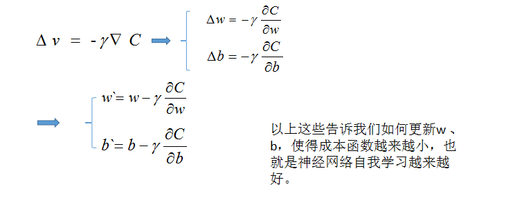
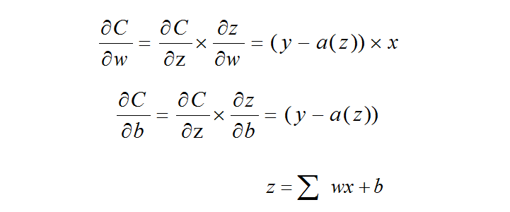
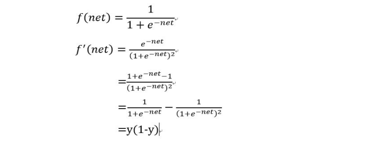

### 公式简化

我们现在来具体地梳理一下关于成本函数的公式：


现在我们对成本函数两边求偏导，表示成本函数的一个小的变化量，则有：


现在我们把上面的公式整理成向量相乘的形式:


[向量相乘的知识链接](http://wenku.baidu.com/link?url=bEgpY1V0Lsw825qh7OHo46FzmXdnXDix7MqFFyFw1ExRFy279Cuff3HgTtMW2GT2uAGLLdN5KfhxHuEylyOsdtnillbY-F0ZLu-c0RTGSX7)
做一些简化得到下面的式子：


前面我们介绍梯度下降法的时候提到过下面一个式子:


那么对于上面的式子，我们可以进一步简化得到这样的式子：




我们把上次的`γ`换成现在的`η`，希望你不要误解，这其实只是一个符号的代换，没有别的用意。

就像上一幅图片里面介绍的，这些简化的步骤最终告诉我们如何更新神经网络的权值以及阈值，在每次进行迭代的时候。我们需要知道下一个`w`、`b`的值是多少，我们只需要给定一个`η`值，也就是学习速率，然后在求解一下那个偏导数就行了，可能你还不太明白，我们接下来要介绍如何求解偏导数，需要用到一些求导的知识。


### 求解偏导数

#### 链式求导

在我们对成本函数求偏导数之前，我们还是来讲解一下链式求导的一些知识吧！链式求导主要应用在复合函数求导方面，什么是复合函数？简单地说，复合函数就是一个函数的自变量是一个函数，平常我们所提到的函数的自变量都假设为一个简单的变量，复合函数就是把简单的变量搞成一个不太简单的函数，其实还是那个熟悉的味道，终归它还是一个普通的函数，就像那一句让人怀疑人生的名言——咸鱼翻了身还是咸鱼。看一下我们的复合函数的一个例子：

```bash
g(x) = x * x

f(z) = sin( z )

下面两个都可以称之为复合函数：

G = g( f(x) ) 

F = f( g(x) )

当然，你还可以变化出多种的样式，不够我相信这个例子已经足够明显了。
```

我们就拿上面一个函数来举个例子吧——`G = g( f(x) )`，那么G关于`f(x)`的导数是什么呢？

```bash
G 关于f(x)的导数是：
G' = 2 * f( x )

那么G关于x的导数是什么呢？我们可以这样理解，G关于x的导数是G关于f(x)的导数然后f(x)关于x的导数的乘积，那么它的结果就是(使用G'(x) 表示G关于x的导数）：

G'(x) = G'(f)* f'(x) = 2 * f(x) * cos( x ) = 2 * sin( x ) * cos( x )
```

用符号表示就是：


好了，关于链式求导我们讲解到此就结束了，如果你觉得我的解释不够清楚的话，我建议你先跳到这个链接学习一下——[维基百科——链式法则](https://zh.wikipedia.org/wiki/%E9%93%BE%E5%BC%8F%E6%B3%95%E5%88%99)。

#### 成本函数的偏导数

我们这里在把成本函数列出来，然后看看我们具体的求解步骤：





关于最后那个`a'(z)`是怎么求导的，在下面的图片中，打这些公式真是麻烦，所以幸好在网上有一位好心人发出来了，我就顺便截个图，其实它的解法也很简单，使用的也是复合函数求导的技巧，我可以给你一个连接，如果你有兴趣的话，可以进去看看——[sigmoid函数求导链接](http://tieba.baidu.com/p/3526239227)




好了，我们已经解决了怎么使用梯度下降法来寻找下一个权值与阈值的问题了，接下来我们应该做的是如何使用反向传播这个算法了，那就往下看吧！

[Prev]( 3.md ) [Next]( 5.md )
