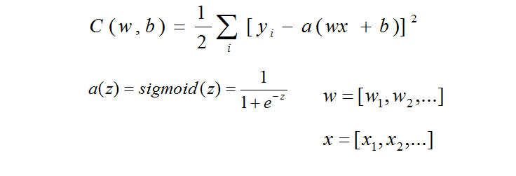

### 公式简化

我们现在来具体地梳理一下关于成本函数的公式：

现在我们对成本函数两边求偏导，表示成本函数的一个小的变化量，则有：

现在我们把上面的公式整理成向量相乘的形式:

[向量相乘的知识链接](http://wenku.baidu.com/link?url=bEgpY1V0Lsw825qh7OHo46FzmXdnXDix7MqFFyFw1ExRFy279Cuff3HgTtMW2GT2uAGLLdN5KfhxHuEylyOsdtnillbY-F0ZLu-c0RTGSX7)
做一些简化得到下面的式子：

前面我们介绍梯度下降法的时候提到过下面一个式子:

那么对于上面的式子，我们可以进一步简化得到这样的式子：
