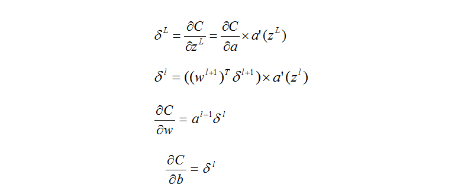

### 反向传播

前面我们已经介绍成本函数关于权值与阈值的偏导数的求解方法，并且已经给出了公式。你可以发现在两个偏导数的公式中都有一个式子——`y-a(z)`，这玩意是什么东西？我们在前面定义过，`y`表示某一层神经元的在某一个数据输入下的期望输出，而`a(z)`是实际输出。这就有点儿是当前神经层的一个误差了，虽然我们在介绍成本函数的时候说误差一把要平方一下，但是刚才的式子其实也是一种误差，不是吗？不过现在我们不会再纠结于这个东西了，我们要说的是神经网络如何使用这些参数的。

对于一组训练的数据，我们知道了输入是多少，期望的输出是多少，如果没有什么反馈，也就是只运行一遍的那种，那么我们也会知道实际的最终输出是多少，现在我们重新定义一下一个神经元的误差（好像咱们这是第三次定义它的误差形式了啊！！！）不过这个误差不再是简单的期望输出与实际输出的误差，而是一种变化量。

想象一下，我们的成本函数是关于`z`的函数，那么我们假设我们改动一下`z`的值，那么成本函数应该是会发生改变的，现在我们定义这种因为改变`z`而成本函数发生改变的该变量称之为一种误差，对于一个神经元是这样的，那么我们也可以想象对于整个一个的神经层也应该是一样的，我们还是像前面一样使用向量的方式来表示整个神经层的这种误差，对于最后一层，我们使用下面的方式来表示：

对这个式子是不是似曾相识，是的，我们在前面就是用过，在求解成本函数的偏导数的时候。那么我们现在就可以使用这个值来计算出最后一层的各个神经元的权值与阈值的该变量了，因为这个函数的自变量都是已知的，所以可以直接代入数据进行求解，进而求解出最后一层的阈值与权值的该变量。现在我们应该往前推进一层了，我们想找到一个前一层与当前层的误差的关系，让它们之间有一些联系。我们现在给出一个公式，将前一层的神经元的误差与当前层的神经元的误差结合到一起，但是我个人还没有搞懂这个公式到底是怎么得来的，在原文中也刻意跳过去了，所以这里只能说抱歉了，一旦我明白了其中的推导过程，我会更新这里的。那么这个式子是什么呢？

### 本章结语

公式推导到这里就结束了，我们可以通过成本函数的偏导数来得知如何更新权值与阈值，另外我们可以通过最后一层——输出层的误差来求得前一层的误差，最终我们总结出如下的四个公式：

如果你对这些公式有一些疑惑，那么你应该往前翻看一下，熟悉一下前面我们得到的公式，好了，我们将公式已经推导完了，现在是时候使用Python来实现它了。

[Prev]( 4.md )   [Next]( ../chapter3/1.md )